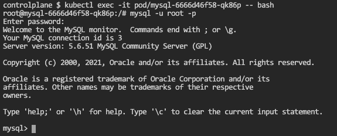
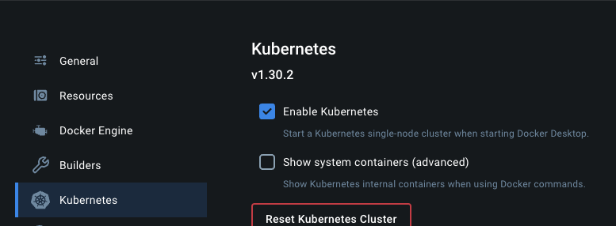

# Data on Kubernetes - Getting Started Guide

Contributors: Paul Au, Ryan Wallner, Jonathan Battiato, Kallio Prinewill

## Project Proposal
[Proposal](https://docs.google.com/document/d/1-6FSuRvWGjlvNZM0pKg6wzFD8W99Z3p2DngEYgjix2o/edit)

## Project Description

The barrier to entry for any technology and community surrounding that technology can often be quite high. The purpose of this document is to capture existing resources that we can leverage to help create a roadmap for DoK beginners.

The secondary purpose of this document is to capture gaps in existing content so we can, as a community, create content to fill those gaps.

## Goals

Provide a set of resources to help guide a complete beginner with the base set of knowledge to start running data workloads on Kubernetes.

We will break the content into sections in a logical order to guide someone from DoK beginner to deploying their first stateful application on kubernetes.

## Table of Contents
- [Why Stateful on Kubernetes?](#why-stateful-on-kubernetes)
- [Intro to Stateful](#intro-to-stateful)
- [Types of workloads](#types-of-workloads)
- [Operators 101](#operators-101)
- [Ecosystem 101](#ecosystem-101)
- [Deploy your first database on kubernetes](#deploy-your-first-database-on-kubernetes)
- [Next Steps](#next-steps)
  
## Why Stateful on Kubernetes

According to past DoK reports, the following are some of the reasons 
- Kubernetes has become a core part of IT – half of the respondents are running 50% or more of their production workloads on it, and they are very satisfied and more productive as a result. The most advanced users report 2x or greater productivity gains.
- Business demands are creating pressures for further adoption. The increasing importance of real-time data to competitive advantage will sharpen companiesʼ need to run data on Kubernetes. A majority believe standards will improve data management and that data should become declarative.
- Standardization is the key driver for Kubernetes Leaders.


## Intro to Stateful

### Purpose

A stateful workload, differently than a stateless workload, is an application or a process that stores any sort of information in a persistent way.
Kubernetes supports data persistency for this type of workloads thanks to the API which abstractd the attached storage. The API provides the **PersistentVolume** and **PersistentVolumeClaim** Kubernetes resources in order to allow users to consume abstract storage resources on either Pods or StatefulSets that require to persist their data.

### Resources

- [Documentation on Stateful Sets from Kubernetes](https://kubernetes.io/docs/tutorials/stateful-application/basic-stateful-set/)
- [Stateful Workloads in Kubernetes: A Deep Dive - Kaslin Fields & Michelle Au, Google](https://youtu.be/688K9UlEbPk?si=BNH7a5JWMlZWtbyU)
- [Persistent Volumes](https://kubernetes.io/docs/concepts/storage/persistent-volumes/)

## Types of workloads

### Purpose

Provide a list of stateful workloads that exist on Kubernetes and a description/examples of each workload
Stateful Workloads

- Databases (stateful sets or CRD)
- AI/ML (usually jobs) - [https://developers.redhat.com/aiml/ai-workloads](https://developers.redhat.com/aiml/ai-workloads)
- Batch processing jobs
- Stream processing
- Machine learning and AI workloads
- Data analytics
- ETL (Extract, Transform, Load) pipelines
- Data warehousing
- Distributed databases
- In-memory data grids
- Time series databases
- Search and indexing engines


## Operators 101

"The goal of an Operator is to put operational knowledge into software" - https://operatorhub.io/what-is-an-operator

Operators takes knowledge of how to implement, deploy, run, maintain and protect software applications on Kubernetes and puts it into a repeatable framework for automation. The framework and automation in turn provide Day 1 Operations (installation, configuration, etc.) and Day 2 Operations (re-configuration, update, backup, failover, restore, etc.) for applications. You can read more about the framework at the [operatorframework.io](https://operatorframework.io/)

#### Purpose
Provide resources explaining what operators are and what role they play in running data workloads on kubernetes

#### Resources:
- [What is a kubernetes Operator](https://www.redhat.com/en/topics/containers/what-is-a-kubernetes-operator)
- [What are Kubernetes Operators (Operators 101 :part 1)](https://sklar.rocks/what-are-kubernetes-operators/)
- [Operator Pattern](https://kubernetes.io/docs/concepts/extend-kubernetes/operator/)
- [Custom Resource Definitions](https://kubernetes.io/docs/concepts/extend-kubernetes/api-extension/custom-resources/)
- [An Introduction to Custom Resource Definitions and Custom Resources (Operators 101: Part 2)](https://sklar.rocks/kubernetes-custom-resource-definitions/)
- [Operator Hub]( https://operatorhub.io/) OR visit
https://www.cncf.io/blog/2022/06/15/kubernetes-operators-what-are-they-some-examples/
- [Celebrating 10 years of Kubernetes: The evolutio of databse operators](https://www.cncf.io/blog/2024/06/28/celebrating-10-years-of-kubernetes-the-evolution-of-database-operators/)


## Ecosystem 101

### Purpose

List and describe open source projects that are a part of the DoK Ecosystem. This list is not comprehensive.

- [DoK Landscape](https://dok.community/landscape/)

### Databases
- [Vitess](https://vitess.io/) - MySQL-compatible, horizontally scalable, cloud-native database solution
- [Cassandra](https://cassandra.apache.org/_/index.html) - Apache Cassandra is a highly-scalable partitioned row store. Rows are organized into tables with a required primary key.
- [PostgreSQL](https://www.postgresql.org/) - PostgreSQL is a powerful, open source object-relational database system that uses and extends the SQL language combined with many features that safely store and scale the most complicated data workloads.

### Cloud Native Storage

- [Rook](https://rook.io/): Rook is an open source cloud-native storage orchestrator, providing the platform, framework, and support for Ceph storage to natively integrate with cloud-native environments.
- [CubeFS](https://cubefs.io/): CubeFS is a new generation cloud-native open source storage system that supports access protocols such as S3, HDFS, and POSIX.
- [Longhorn](https://longhorn.io/): Longhorn is a lightweight, reliable and easy-to-use distributed block storage system for Kubernetes.

### Scheduling
- [Apache Airflow](https://airflow.apache.org/):Apache Airflow is an open-source tool for managing data workflows, including scheduling, monitoring, and creating them.

### Streaming
- [Kafka](https://kafka.apache.org/):  Apache Kafka is an open-source distributed event streaming platform used by thousands of companies for high-performance data pipelines, streaming analytics, data integration, and mission-critical applications. 
  - [Running Apache Spark on Kubernetes](https://medium.com/empathyco/running-apache-spark-on-kubernetes-2e64c73d0bb2)   
- [Spark](https://spark.apache.org/): Apache Spark™ is a multi-language engine for executing data engineering, data science, and machine learning on single-node machines or clusters. 
  - [Run Apache Spark jobs on Amazon EKS using the OSS Spark Operator](https://awslabs.github.io/data-on-eks/docs/blueprints/data-analytics/spark-operator-yunikorn) 
- Flink: Apache Flink is a framework and distributed processing engine for stateful computations over unbounded and bounded data streams. Flink has been designed to run in all common cluster environments, perform computations at in-memory speed and at any scale.
- [Strimzi](https://strimzi.io/): Strimzi provides a way to run an Apache Kafka cluster on Kubernetes in various deployment configurations.
  - [Running Kafka on Kubernetes using Strimzi](https://dev.to/vinod827/harnessing-apache-kafka-on-kubernetes-with-strimzi-5fjg)

### AI/ML
- [Ray](https://www.ray.io/): Ray manages, executes, and optimizes compute needs across AI workloads. It unifies infrastructure via a single, flexible framework—enabling any AI workload from data processing to model training to model serving and beyond.
  - [Managing Ray clusters for ML on Kubernetes with KubeRay](https://www.youtube.com/watch?v=1vGb0nn5n0o)
- [Kubeflow](https://www.kubeflow.org/): Kubeflow makes artificial intelligence and machine learning simple, portable, and scalable. We are an ecosystem of Kubernetes based components for each stage in the AI/ML Lifecycle with support for best-in-class open source tools and frameworks.

### Batch Processing
- [Apache YuniKorn](https://yunikorn.apache.org/): light-weight, universal resource scheduler for container orchestrator systems.

## Deploy your first database on kubernetes
#### Purpose
In this section, you'll learn how to use the knowledge you've accumulated to deploy a database to kubernetes. 

### **Deploy MySQL using Killercoda Playground**

**Step 1:** Launch the Killercoda Kubernetes Lab Environment from your web browser

[Click here to access the environment](https://killercoda.com/playgrounds/scenario/kubernetes)

**Step 2:**  Launch a MySQL Instance

```
kubectl apply -f https://k8s.io/examples/application/mysql/mysql-pv.yaml
kubectl apply -f https://k8s.io/examples/application/mysql/mysql-deployment.yaml
```


**Step 3:**  View your MySQL Instance Running

```
kubectl get pvc, po
```


**Step 4:**  Attach to MySQL

When prompted for the MySQL password, it is `password`
```
kubectl exec -i -t $(kubectl get pod -l app=mysql -o name) -- bash
mysql -u root -p
```



When you would liked to exit from the pod, type `exit` twice.

You've succesfully deployed your first Stateful Database (MySQL) on Kubernetes with a persistent volume.

### **Run MongoDB using Docker Desktop**

**Step 1:**  Install [Docker Desktop](https://docs.docker.com/desktop/)

**Step 2:**  Enable [Kubernetes on Docker Desktop](https://docs.docker.com/desktop/kubernetes/)



**Step 3:**  Set your context using `kubectl`

```
kubectl config get-contexts
kubectl config use-context docker-desktop
```

**Step 4:**  Run a MongoDB StatefulSet

You can copy the [example MongoDB YAML](assets/mongo.yaml) and save it locally to `mongo.yaml`.
```
kubectl apply -f mongo.yaml
```

**Step 5:**  View your Mongo database
```
kubectl get pvc, po
```

It should look something like this
```
kubectl get pvc,po              
NAME                                           STATUS   VOLUME                                     CAPACITY   ACCESS MODES   STORAGECLASS   VOLUMEATTRIBUTESCLASS   AGE
persistentvolumeclaim/mongodb-data-mongodb-0   Bound    pvc-272ffc2a-2936-4609-a7b7-0cd20a8135af   1Gi        RWO            hostpath       <unset>                 77s
persistentvolumeclaim/mongodb-pvc              Bound    pvc-4b6071be-5425-473e-a214-07d9b8db0213   1Gi        RWO            hostpath       <unset>                 77s

NAME            READY   STATUS    RESTARTS   AGE
pod/mongodb-0   1/1     Running   0          77s
```

**Step 6:**  Attach to your Mongo Database

```
kubectl exec -it pod/mongodb-0 -- bash
mongosh
```

You can then `shows dbs` and `use myNewDB` to test out the Mongo Database
```
test> show dbs
test> use myNewDB
switched to db myNewDB
myNewDB>
```

When you would liked to exit from the pod, type `exit` twice.

You've succesfully deployed your first StatefulSet Database (MongoDB) on Kubernetes with a persistent volume.

#### Resources:
- [K8s Run Single Instance Stateful App](https://kubernetes.io/docs/tasks/run-application/run-single-instance-stateful-application/)
- [K8s on Docker Desktop](https://docs.docker.com/desktop/kubernetes/)
- [Deploy MongoDB](https://medium.com/@ravipatel.it/deploying-mongodb-on-kubernetes-minikube-2c4f19a151f7)
- [Killercoda K8s Environment](https://killercoda.com/playgrounds/scenario/kubernetes)

## Next Steps

Now that you hopefully have gained an understanding of how to get started with Data on Kubernetes. It's time to think about next steps.

Next steps might be thinking beyond how to get started and tackeling some of the following topics.
- High Availability
- Multi-Cluster / Multi-Cloud
- Backup and Recovery
- Disaster Recovery
- Snapshots and Data Replication
- Encryption
- Running and managing multiple types of data services
- Performance

#### Purpose
In this section, we'll list some resources to push you to the next level of understanding.

#### Resources:
- [Volume Snapshots](https://kubernetes.io/docs/concepts/storage/volume-snapshots/)
- [Open-source Backup Solution Velero](https://velero.io/)

## Do you want to contribute?

This is a community driven resource and we welcome contributions from the Data on Kubernetes Community. If you would like to contribute to this resource, feel free to submit a pull request.

## What's missing?

Are there topics you would like us to cover that you don't see above? Let us know! Fill out the form and let us know what you would like us to cover.

[Submit a request](https://forms.gle/PxuYw2BLkCsKHqFS8)


